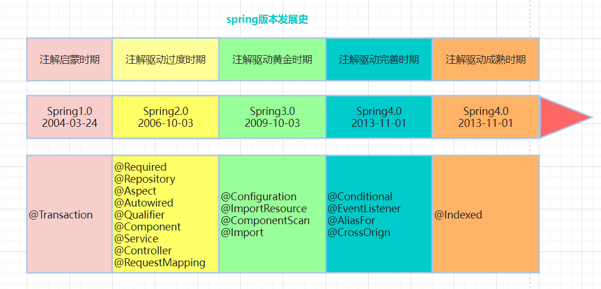

# springboot

# 1. Spring 版本发展历史                  

##  

## **1.1 spring 1.x**

提供了IoC,AOP及XML配置的方式

在spring1.x版本中提供的是纯XML配置的方式

在spring1.2版本提供了@Transaction注解，简化了事务操作

## **1.2 spring 2.x**

2.5之前增加的注解 @Required @Reponsitory @Aspect

同时也扩展了XML的配置能力，提供了第三方的扩展标签

spring2.5之后，新增了很多常用注解，简化了配置

| 注解            | 说明                   |
| --------------- | ---------------------- |
| @Autowired      | 依赖注入               |
| @Qualifier      | 配置@Autowired注解使用 |
| @Component      | 声明组件               |
| @Service        | 声明业务层组件         |
| @Controller     | 声明控制层组件         |
| @RequestMapping | 声明请求对应的处理方法 |

在这些注解的作用下，不需要再xml文件中去注册bean，只需要在xml中配置扫描组件，指定扫描路径即可，简化了配置维护工作

 <context:component-scan base-package="com.xxxx" />

虽然spring2.5版本提供了很多的注解，简化了配置开发，但依然没有摆脱xml配置驱动

## **1.3 spring 3.x**

注解发展的一个里程碑版本，提供了@Configuration注解，目的就是去xml配置。同时通过@ImportResource来实现Java配置类和XML配置的混合使用来实现平稳过度；

@ComponentScan作用是指定扫描路径，用来代替XML中的<component-scan>标签，默认的扫描路径是当前注解标注的类所在的包及其子包，当然也可以指定特定的扫描路径

@Import 该注解只能作用在类上（注解也是类），作用是快速的将实例导入到spring的IoC容器中，将实例导入IoC容器中的方式有很多种，比如@Bean注解

@Import可以用于导入第三方包，具体的方式有三种：

静态导入 @Import(value={UserService.class})

动态导入ImportSelect @Import(XXXImportSelector.class)

导入实现了ImportSelector接口的类，重新selectImports方法，那么就会把该返回返回的所以类名的实例注入到容器中

动态导入 ImportBeanDefinitionRegistrar ，相比ImportSelector接口的方式，ImportBeanDefinitionRegistrar的方式是直接在定义的方法中提供了BeanDefinitionRegistry,自己在方法中实现注册。

@EnableXXX 启用某个模块功能，其实是对Import的包装

## **1.4 spring 4.x**

完全支出jdk1.8.注解完善的时代。核心注解是@Contitional，作用是按照一定的条件进行判断，满足条件就注册Bean实例到容器中。给我们提供了对象导入IoC容器的条件机制，这也是SpringBoot的自动装配的核心关键。

4.x 还提供了一些其它的注解支持，比如@EventListener,作为ApplicaitonListener接口编程的第二选择；@AliasFor注解解除注解派生的时候的冲突限制


## **1.5 spring 5.x**

5.0 是spring2.0的底层。在springboot应用场景中，大量使用@ComponentScan扫描，导致Spring模式的注解解析时间耗时增大，因此引入@Indexed注解，为spring模式注解添加索引


当我们在项目中使用了@Indexed之后，编译打包的时候会在项目中自动生成META-INF/sping.components文件。当spring应用上下文执行CompentScan扫描是，META-INF/spring.compoents将会被CandidataComponentsIndexLoader读取并加载。这样的话@CompenentScan不在扫描指定的package,而是读取CandidataComponentIndex对象，从而达到提升性能的目的。

项目需引入依赖：

```xml
<dependency>
    <groupId>org.springframework</groupId>
    <artifactId>spring-context-indexer</artifactId>
</dependency>
```


# 2. Springboot 版本发展历史


# 3. spi

spi,全程为service provider interface,是一种服务发现机制。jdk 中的spi是通过在classpath路径下的META-INF/services文件夹查找文件，自动加载文件里面定义的类。这一机制为很多框架扩展提供了可能。比如JDBC、Dubbo都使用到了spi机制。


## 3.1 获取spi实例示例

```java
ServiceLoader<XxxInterface> providers = ServiceLoader.load(XxxInterface.class);
Iterator<XxxInterface> iterator = providers.iterator();
while(iterator.hasNext()){
    XxxInterface next = iterator.next();
    next.doXxx();
}
```


## 3.2 jdk spi源码

ServiceLoader

​	首先来看下ServiceLoader的类结构（关键部分）

```java
public final class ServiceLoader<S>
    implements Iterable<S>
{

    // 配置文件路径
    private static final String PREFIX = "META-INF/services/";

    // The class or interface representing the service being loaded
    // 加载的服务类或者接口
    private final Class<S> service;

    // The class loader used to locate, load, and instantiate providers
    // 类加载器
    private final ClassLoader loader;

    // The access control context taken when the ServiceLoader is created
    private final AccessControlContext acc;

    // Cached providers, in instantiation order
    // 缓存已加载的服务类
    private LinkedHashMap<String,S> providers = new LinkedHashMap<>();

    // The current lazy-lookup iterator 
    // 当前懒加载迭代器
    private LazyIterator lookupIterator;

}
```

load

​	load方法创建了一些属性，重要的是实例化了内部类，LazyInterator

```java
/**
     * Clear this loader's provider cache so that all providers will be
     * reloaded.
     *
     * <p> After invoking this method, subsequent invocations of the {@link
     * #iterator() iterator} method will lazily look up and instantiate
     * providers from scratch, just as is done by a newly-created loader.
     *
     * <p> This method is intended for use in situations in which new providers
     * can be installed into a running Java virtual machine.
     */
    public void reload() {
        providers.clear();
        // 实例化内部类
        lookupIterator = new LazyIterator(service, loader);
    }

    private ServiceLoader(Class<S> svc, ClassLoader cl) {
        service = Objects.requireNonNull(svc, "Service interface cannot be null");
        loader = (cl == null) ? ClassLoader.getSystemClassLoader() : cl;
        acc = (System.getSecurityManager() != null) ? AccessController.getContext() : null;
        reload();
    }
```

​	查找实现类和创建实现类的过程，都在LazyIterator完成。当我们调用iterator.hashNext和iterator.next方法时，实际上调用的都是LazyIterator的相应方法。

```java
private class LazyIterator implements Iterator<S>{
	private boolean hasNextService() {
        // 第二次调用的时候，已经解析完成，直接返回
            if (nextName != null) {
                return true;
            }
            if (configs == null) {
                try {
                    // META-INF/services/接口全限定名
                    String fullName = PREFIX + service.getName();
                    // 将文件路径转换成URL对象
                    if (loader == null)
                        configs = ClassLoader.getSystemResources(fullName);
                    else
                        configs = loader.getResources(fullName);
                } catch (IOException x) {
                    fail(service, "Error locating configuration files", x);
                }
            }
            while ((pending == null) || !pending.hasNext()) {
                if (!configs.hasMoreElements()) {
                    return false;
                }
                // 解析URL文件对象，读取内容返回
                pending = parse(service, configs.nextElement());
            }
        	// 拿到第一个实现类的类名
            nextName = pending.next();
            return true;
    }

```

​	创建实例对象。调用next方法，实际上是调用的lookupIterator.nextService.它通过反射的方式，创建实现类的示例并返回。

```java
private S nextService() {
            if (!hasNextService())
                throw new NoSuchElementException();
    		// 全限定类名
            String cn = nextName;
            nextName = null;
            Class<?> c = null;
            try {
                // 创建Class对象
                c = Class.forName(cn, false, loader);
                // 通过newInstance实例化
                S p = service.cast(c.newInstance());
                // 缓存并返回
                providers.put(cn, p);
                return p;
                
            } catch (ClassNotFoundException x) {
                fail(service,
                     "Provider " + cn + " not found");
            }
            throw new Error();          // This cannot happen
        }
```

# 4. Springboot 自动装配原理

Spring Framework 一致在致力于解决一个问题，就是如何把bean的管理变更更简单，如何让开发者尽可能的少关注一些基础化的bean的配置，从而实现自动装配。所谓的自动装配，实际上就是如何自动将bean装载到Ioc容器中来。

实际上在Spirng3.x的版本中，Enable模块驱动注解的出现，已经有了一定的自动装配的雏形，而真正能够实现这一机制，还是在Sping4.x版本中，@Conditional条件注解出现。


## 4.1 深入分析EnableAutoConfiguration

EnableAutoConfiguration的主要作用其实就是帮助Springboot应用把所有符合条件的@Configuration配置加载到当前Springboot创建并使用的Ioc容器中。

```java
@Import({AutoConfigurationImportSelector.class})
public @interface EnableAutoConfiguration {

```

从EnableAutoConfiguration上面的import注解来看，并不是引入另外一个Configuration,而是一个ImportSelector。

## 4.2 AutoConfigurationImportSelector 是什么

Enable注解不仅仅可以实现多个Configuration的整合，还可以实现一些复杂的场景，比如可以根据上下文来激活不容类型Bean.

@Import注解可以配置三种不同的Class

1. 普通bean或者带有@Configuration的bean
2. 实现importSelector接口进行动态注入
3. 实现ImportBeanDefinitionRegistrar接口进行动态注入

Selectror本质是对Bean的动态加载.


## 4.3 @EnableAutoConfiguration注解的实现原理

通过导入第三方提供的Bean的配置类：AutoConfigurationImportSelector

```java
@Import({AutoConfigurationImportSelector.class})
```

从类名基本可以猜测是基于importSelector来实现基于动态bean的加载功能。之前我们讲过Springboot @Enable***注解的工作原理，ImportSelector接口selectImports返回的数组（类的全限定名）都会被纳入到spring容器中.

selectImports

```java
public String[] selectImports(AnnotationMetadata annotationMetadata) {
        if (!this.isEnabled(annotationMetadata)) {
            return NO_IMPORTS;
        } else {
            // 获取所有候选配置类EnableAutoConfiguration
            AutoConfigurationImportSelector.AutoConfigurationEntry autoConfigurationEntry = this.getAutoConfigurationEntry(annotationMetadata);
            return StringUtils.toStringArray(autoConfigurationEntry.getConfigurations());
        }
    }
```

getAutoConfigurationEntry

```java
 protected AutoConfigurationImportSelector.AutoConfigurationEntry getAutoConfigurationEntry(AnnotationMetadata annotationMetadata) {
        if (!this.isEnabled(annotationMetadata)) {
            return EMPTY_ENTRY;
        } else {
            // 获取元注解的属性
            AnnotationAttributes attributes = this.getAttributes(annotationMetadata);
            // 获取候选配置类
            // 通过SpringFactoriesLoader.loadFactoryNames(EnableAutoConfiguration.class,getBeanClassLoader())
            // 方法，加载META-INF/spring.factories文件中的key=org.springframework.boot.autoconfigure.EnableAutoConfiguration对应value的配置类
            List<String> configurations = this.getCandidateConfigurations(annotationMetadata, attributes);
            // 去重
            configurations = this.removeDuplicates(configurations);
            // 排除相关配置类
            Set<String> exclusions = this.getExclusions(annotationMetadata, attributes);
            this.checkExcludedClasses(configurations, exclusions);
            configurations.removeAll(exclusions);
            // 过滤,检查候选配置类上的注解@ConditionOnClass @ContionOnBean,如果要求的类或实例不存在,则这个候选类会被过滤
            configurations = this.getConfigurationClassFilter().filter(configurations);
            // 广播AutoConfigurationImportEvent事件
            this.fireAutoConfigurationImportEvents(configurations, exclusions);
            return new AutoConfigurationImportSelector.AutoConfigurationEntry(configurations, exclusions);
        }
    }
```

关键步骤截图


本质上来说，EnableAutoConfiguration会帮助Springboot应用把所有符合条件的@Configuration配置类加载到当前Springboot创建的Ioc容器中。而这里借助了Spring框架提供的一个工具类SpringFactoriesLoader的支持。以及用到了条件注解@Conditional，选择性的针对需要加载的bean进行条件过滤。

## 4.4 SpringFactoriesLoader

SpringFactoriesLoader工具类和Java中的SPI机制原理是一样的，不过它比SPI更好的点在于不会一次性加载所有的类，而是根据key进行加载。

首先，SpringFactoriesLoader是从classpath/META-INF/spring.factories文件汇中，根据key来加载对应的类到Spring IoC容器中。


## 4.5 Springboot中的条件过滤

在分析AutoConfigurationImportSelector的源码时，会先扫描spring-autoconfiguration-metadata.proerties文件，最后在扫描spring.factories对应的类时，会结合签名的元数据进行过滤，这是为什么呢？因为很多配置类@Configuration是依托于其它框架来加载的，如果当前classpath环境下没有相关的依赖，则意味着没有必要加载，所以，通过条件过滤可以有效的减少@Configuration类的数量降低启动时间

条件过滤有2中方式：

1、在META/INF/增加spring-autoconfiguration-metadata.proerties文件，内容格式为：

xxxx（配置类的全限定名）.ConditionOnClass=xxxxx（class全限定名）

xxxx（配置类的全限定名）.ConditionOnBean = xxxx （Bean实例名）

2、在@Configuration配置类使用条件注解

示例：

```java
@Configuration
@ConditionalOnExpression("!'${spring.messages.basename:}'.isEmpty()")
```

```java
@Configuration
@ConditionalOnProperty(name = "mybatis-plus.enabled", havingValue = "true", matchIfMissing = true)
```

# 5. Springboot 启动过程 run

分析Springboot框架源码不可能一个篇幅搞定，这里只分析Springboot启动的主线流程。

## 5.1 Springboot启动入口

当我们启动一个Springboot项目的时候，入口程序就是一个main()方法，而在main方法中就执行了一个run方法。

```java
@SpringBootApplication
public class IamSsoApplication {
    public static void main(String[] args) {
        SpringApplication.run(IamSsoApplication.class, args);
    }
}
```

## 5.2 run方法

进入run方法中查看，run方法重载了一个run方法，把传递进来的对象封装成了一个数组

```java
public static ConfigurableApplicationContext run(Class<?> primarySource, String... args) {
    return run(new Class[]{primarySource}, args);
}

```

再进入run方法查看

```java
public static ConfigurableApplicationContext run(Class<?>[] primarySources, String[] args) {
    // 创建一个SpringApplication对象，并调用其run方法
    return (new SpringApplication(primarySources)).run(args);
}
```

创建SpringApplication对象，调用构造方法

```java
public SpringApplication(Class<?>... primarySources) {
    this((ResourceLoader)null, primarySources);
}

public SpringApplication(ResourceLoader resourceLoader, Class<?>... primarySources) {
    	// 传递的resourceLoader为null
		this.resourceLoader = resourceLoader;
		Assert.notNull(primarySources, "PrimarySources must not be null");
    	// 记录主配置类
		this.primarySources = new LinkedHashSet<>(Arrays.asList(primarySources));
    	// 推断服务器类型 NONE SERVLET REACTIVE
		this.webApplicationType = WebApplicationType.deduceFromClasspath();
		this.bootstrapRegistryInitializers = getBootstrapRegistryInitializersFromSpringFactories();
    	// 加载spring.factories中ApplicationContextInitializer类型并实例化,并保存到initializers变量中
		setInitializers((Collection) getSpringFactoriesInstances(ApplicationContextInitializer.class));
    	// 加载spring.factories中ApplicationListener类型并实例化,并保存到listeners变量中
		setListeners((Collection) getSpringFactoriesInstances(ApplicationListener.class));
    	// 推断出启动类class对象
		this.mainApplicationClass = deduceMainApplicationClass();
}
```


Springboot 属性文件加载的过程和顺序

Springboot的监听机制

Springboot内嵌Tomcat等Web容器的原理

Springboot健康检查Acuator


