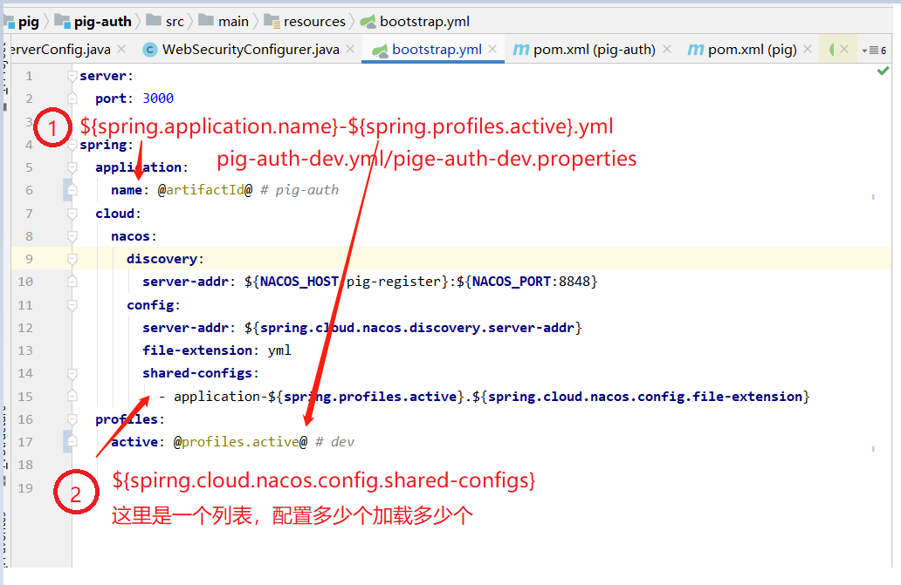

# springcloud读取nacos多个配置文件

第一个：

${spring.application.name}-${spring.profiles.active}.properties  或者 ${spring.application.name}-${spring.profiles.active}.yml

第二个及第N个：

${spirng.cloud.nacos.config.shared-configs}

